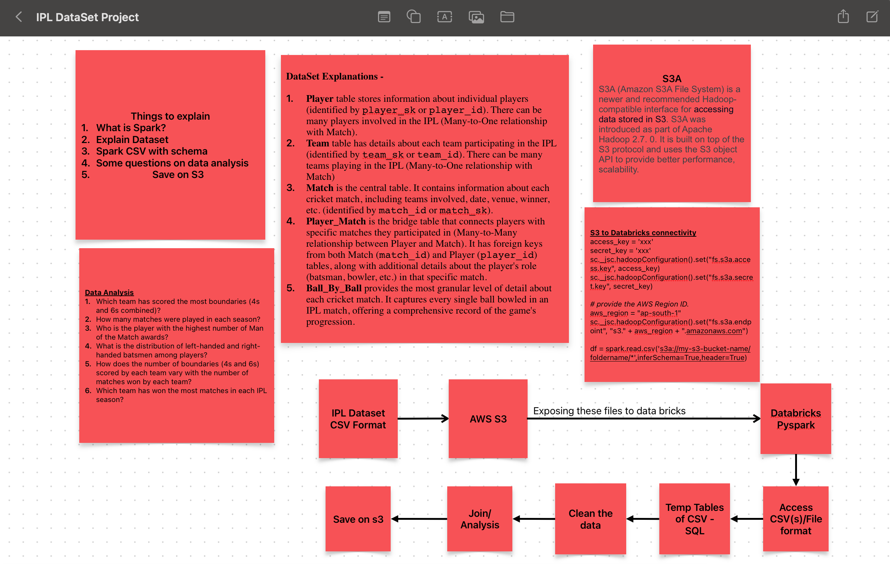

# IPLDataSet
## Overview
This project represents our first dive into data engineering. Our goal is to establish a data pipeline that streamlines analysis. By harnessing the power of Amazon S3 alongside Spark, we're focused on effectively processing our data.

## DataSet Explanations -

- **Player** table stores information about individual players (identified by player_sk or player_id). There can be many players involved in the IPL (Many-to-One relationship with Match).
- **Team** table has details about each team participating in the IPL (identified by team_sk or team_id). There can be many teams playing in the IPL (Many-to-One relationship with Match)
- **Match** is the central table. It contains information about each cricket match, including teams involved, date, venue, winner, etc. (identified by match_id or match_sk).
- **Player_Match** is the bridge table that connects players with specific matches they participated in (Many-to-Many relationship between Player and Match). It has foreign keys from both Match (match_id) and Player (player_id) tables, along with additional details about the player's role (batsman, bowler, etc.) in that specific match.
- **Ball_By_Ball** provides the most granular level of detail about each cricket match. It captures every single ball bowled in an IPL match, offering a comprehensive record of the game's progression.

## Data Analysis Questions - 
- Which team has scored the most boundaries (4s and 6s combined)?
- How many matches were played in each season?
- Who is the player with the highest number of Man of the Match awards?
- What is the distribution of left-handed and right-handed batsmen among players?
- How does the number of boundaries (4s and 6s) scored by each team vary with the number of matches won by each team?
- Which team has won the most matches in each IPL season?

## What is RDD?
RDD stands for resilient distributed dataset. It is basic unit which holds the data in spark.
RDD does not consist of any schema. It is just raw data which is distributed across various partitions.